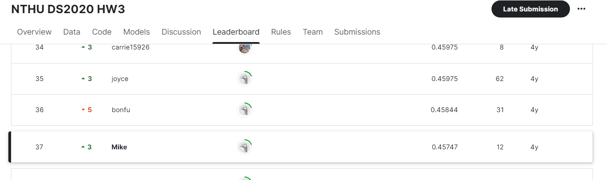

# NTHU-DS2020-lab3

NTHU CS5701 Data Science during the spring semester of 2020.
- Instructor: Prof. [Shen, Chih-Ya](https://www.cs.nthu.edu.tw/~chihya/)

## Kaggle Competition
- Goal: Predict rain today
- dataset:

    16 numeric features, 5 nominal features, 1 label
- Strategy:
   1. Dealing with missing value
   2. Data normalization
   3. Imbalanced Data
   4. Select a training model
- Leaderboard:
    37/87
    
